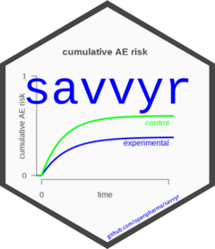

<!-- README.md is generated from README.Rmd. Please edit that file -->

# savvyr 

<!-- badges: start -->

[](https://www.repostatus.org/#active)
[](https://www.r-pkg.org/badges/version-last-release/savvyr)
[](https://cranlogs.r-pkg.org/badges/savvyr)
[](https://cranlogs.r-pkg.org/badges/grand-total/savvyr)
[](https://raw.githubusercontent.com/openpharma/savvyr/_xml_coverage_reports/data/main/coverage.xml)
<!-- badges: end -->  

The SAVVY project is a consortium of academic and pharmaceutical
industry partners that aims to improve the analyses of adverse event
(AE) data in clinical trials through the use of survival techniques
appropriately dealing with varying follow-up times and competing events.
Although statistical methodologies have advanced, in AE analyses often
the incidence proportion, the incidence density or a non-parametric
Kaplan-Meier estimator are used, which either ignore censoring or
competing events. The `savvyr` package contains functions to easily
conduct the proposed improved AE analyses.

## Installation

### Release

You can install the current release version from *CRAN* with:

``` r
install.packages("savvyr")
```

### Development

You can install the development version of savvyr from
[GitHub](https://github.com/) with:

``` r
if (!require("remotes")) {
  install.packages("remotes")
}
remotes::install_github("openpharma/savvyr")
```

## Getting Started

See the [introductory
vignette](https://openpharma.github.io/savvyr/main/articles/introduction.html)
to get started.

## Citing `savvyr`

To cite `savvyr` please see
[here](https://openpharma.github.io/savvyr/main/authors.html#citation).
